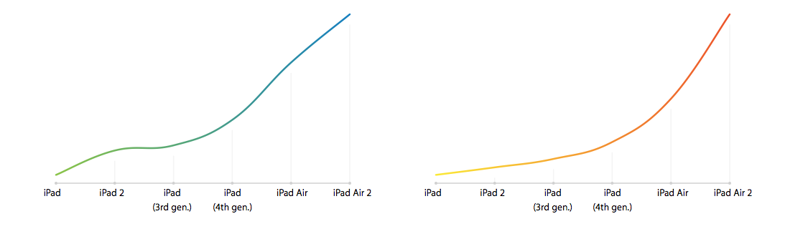

<div style="text-align:center"></div>

## Usage
Include `Base.js`, `AppleGrapher.js` and `AppleGrapherElements.js` in this order before the closing `</body>` tag of your document.

You also have the options to use the ultra-minified version with `AppleGrapher.min.js`. Be advised that this library weighs slightly more than 200 KB.

To use labels, you also need to include `AppleGrapher.css`.


```html
<body>
	<div class="chart chart1"></div>
	<div class="chart chart2"></div>
	<div class="donut chart3">
		<div class="donut-label">
			<span class="label">0</span>
		</div>
	</div>
	<div class="donut chart4">
		<div class="donut-label">
			<span class="label">0</span>
		</div>
	</div>
</body>
```
```javascript
var demo_options_curvedLine_cpu = {
	type: "curvedLine",
	selector: document.querySelector(".chart1"),
	options: {
		width: 418,
		height: 245,
		graphData: ipad_cpu,
		splinewidth: 2.5,
		splineColorEnd: "rgb(21, 137, 201)",
		splineColorStart: "rgb(149, 202, 82)",
		tension: 0.6,
		yAxisLineColor: "#f5f5f5",
		xAxisLineDotSize: 2,
		labels: [
			"iPad",
			"iPad 2",
			"iPad<br>(3rd gen.)",
			"iPad<br>(4th gen.)",
			"iPad Air",
			"iPad Air 2" 
		]
	}
};
var demo_options_curvedLine_gpu = {
	type: "curvedLine",
	selector: document.querySelector(".chart2"),
	options: {
		delay: 1,
		width: 418,
		height: 245,
		graphData: ipad_gpu,
		splinewidth: 2.5,
		splineColorStart: "rgb(251, 236, 62)",
		splineColorEnd: "rgb(238, 91, 47)",
		tension: 0.6,
		yAxisLineColor: "#f5f5f5",
		xAxisLineDotSize: 2,
		labels: [
			"iPad",
			"iPad 2",
			"iPad<br>(3rd gen.)",
			"iPad<br>(4th gen.)",
			"iPad Air",
			"iPad Air 2" 
		]
	}
};

var demo_options_donut = {
	type: "donut",
	selector: document.querySelector(".chart3"),
	options: {
		bgAnimate: false,
		bgPercent: 1,
		bgColor: "#f5f5f5",
		delay: 2,
		duration: 1,
		fillPercent: 0.87,
		fillColor: "rgb(21, 137, 201)",
		label: document.querySelector(".chart3 span.label"),
		easing: "easeInOutExpo",
		size: 235,
		lineWidth: 8
	}
}
var demo_options_segmentedDonut = {
	type: "segmented",
	selector: document.querySelector(".chart4"),
	options: {
		delay: 3,
		slices: [{
			color: "#af9308",
			value: 72
		}, {
			color: "#79a21c",
			value: 72
		}, {
			color: "#78a061",
			value: 72
		}, {
			color: "#548c8c",
			value: 72
		}, {
			color: "#3b5f62",
			value: 72
		}
		],
		duration: 1,
		gap: 0.25,
		easing: "linear",
		size: 235,
		lineWidth: 20,
		label: {
			duration: 1000,
			delay: 0,
			finalNumber: 3141,
			element: ".chart4 .label"
		}
	}
}

var demo = new AppleGrapher([
	demo_options_curvedLine_cpu,
	demo_options_curvedLine_gpu,
	demo_options_donut,
	demo_options_segmentedDonut
]);

```

Example data is included in the variables `ipad_cpu` and `ipad_gpu`.

## Parameters
### CurvedLine

<div style="text-align:center"></div>

| Parameter            | Type    | Usage                                                                                                    | Default Value          |
|----------------------|---------|----------------------------------------------------------------------------------------------------------|------------------------|
| autoPlay             | boolean | Should the graph start plotting on init                                                                  | true                   |
| delay                | float   | Time between init and plotting                                                                           | 0                      |
| graphData            | Object  | The data the graph is supposed to display. If no data is specified, the graph won't render               | null                   |
| tension              | float   | Haven't found out yet. Probably speed or something                                                       | 0.3                    |
| splinewidth          | float   | The width of the rendered line (the actual graph)                                                        | 4.5                    |
| splineColorStart     | String  | Specifies the gradient color at the beginning. RGB color as String 'rgb(214,214,214)', values from 0-255 | "rgb(214,214,214)      |
| splineColorEnd       | String  | Same as above, but for the gradient end                                                                  | "rgb(0,0,0)"           |
| xAxisLineWidth       | float   | X axis width                                                                                             | 1.5                    |
| xAxisLineColor       | String  | X axis color, supports RGB, HEX or color names                                                           | "#D6D6D6"              |
| xAxisLineDotColor    | String  | X axis dot color, supports RGB, HEX or color names                                                       | "#D6D6D6"              |
| xAxisLineDotSize     | float   | X axis dot size                                                                                          | 3                      |
| yAxisLineWidth       | float   | Y axis width                                                                                             | 1.5                    |
| yAxisLineColor       | String  | Y axis color, supports RGB, HEX or color names                                                           | "#D6D6D6"              |
| yAxisLineOffset      | float   | Distance between graph and Y axis lines                                                                  | 15                     |
| shouldShowPlotPoints | boolean | Displays plot points on the graph (iPhone 6 - Performance)                                               | false                  |
| plotPointDotSize     | boolean | Plot point dot size                                                                                      | 4                      |
| pointColor           | String  | Currently no documented effect                                                                           | "#D6D6D6"              |
| padding              | float   | Padding on the graph's left side                                                                         | 5                      |
| width                | integer | Graph width                                                                                              | Graph container width  |
| height               | integer | Graph height                                                                                             | Graph container height |
| labels               | Object  | Optional labels, will be displayed beneath Y axis lines                  | null

### Donut

<div style="text-align:center"></div>

| Parameter   | Type        | Usage                                                                             | Default Value    |
|-------------|-------------|-----------------------------------------------------------------------------------|------------------|
| autoPlay    | boolean     | Animate the donut after initializing it                                           | true             |
| bgAnimate   | boolean     | Animate the background (if available) upon creation                               | false            |
| bgPercent   | float       | Set the radial progress for the background ring                                   | 1                |
| bgColor     | String      | Set the background color. Supports RGB, HEX or color names                        | "#CCC"           |
| delay       | float       | Wait for the specified time before the animation begins                           | 0                |
| duration    | float       | Set the duration of the animation                                                 | 0                |
| fillPercent | float       | Set the total radial progress for the foreground ring                             | 1                |
| fillColor   | String      | Set the foreground color. Supports RGB, HEX or color names                        | "#CCC"           |
| label       | HTMLElement | Specifies an optional label that shows the progress as a numeric value            | null             |
| easing      | String      | Set the easing function for the animation. Uses Robert Penner's Easing Equations. | "easeInOutQuint" |
| size        | integer     | Sets the canvas width and height.                                                 | 235              |
| lineWidth   | float       | Sets the width of the foreground and background rings                                        | 5                |

### SegmentedDonut

<div style="text-align:center"></div>

| Parameter | Type      | Usage                                                                                                | Default Value |
|-----------|-----------|------------------------------------------------------------------------------------------------------|---------------|
| slices    | Object    | Required. Slices to display                                                                          | null          |
| label     | CSSString | Optional. Sets the label to display a certain value                                                  | null          |
| autoPlay  | boolean   | Animate the donut after initializing it                                                              | true          |
| delay     | float     | Wait for the specified time before the animation begins                                              | 0             |
| duration  | float     | Sets the duration of the animation                                                                   | 0             |
| gap       | float     | Sets the gap between the slices                                                                      | 0             |
| easing    | String    | Set the easing function for the animation. Uses Robert Penner's Easing Equations. "linear" recommended | "linear"      |
| size      | integer   | Sets the canvas width and height.                                                                    | 235           |
| lineWidth | float     | Sets the width of the slices                                                                         | 5             |

## Labels


### CurvedLine

Add the `label` object to the parameters to add labels. A label's position depends on the count of data points, not on the label count.

```javascript
options: {
	/* ... */
	labels: [
		"iPad",
		"iPad 2",
		"iPad<br>(3rd gen.)",
		"iPad<br>(4th gen.)",
		"iPad Air",
		"iPad Air 2" 
	]
	/* ... */
}
```

This code adds six labels to your chart. The wider the chart is, the more labels fit in.

### Donuts and SegmentedDonuts

Add the following code to your donut holder. There is no need to customize it, only through CSS.

```html
<div class="donut-label">
	<span class="label">0</span>
</div>
```

## Export a graph as an image

To export a graph as an image, call the `convertToImg()` method. This will convert the canvas to a PNG image and sets the current browser location to the data URI. From there you can save the image.

Graphs are stored inside a variable called `graphs` in the AppleGrapher object, in the order in which you initialized the graphs. For example if you only have one graph, it will be stored at index `0`.

```javascript
var demo = new AppleGrapher([demo_options_curvedLine_cpu]);

demo.graphs[0].convertToImg();
// Converts the selected graph to a PNG image
```

Labels are currently not included in exported images.

## Easing Functions

Have a look at Robert Penner's [Easing Equations](http://easings.net/).

These are the easing functions supported by AppleGrapher:

| Easing Function | Supported | Easing Function  | Supported |
|-----------------|-----------|------------------|-----------|
| easeIn          | YES       | easeInExpo       | YES       |
| easeOut         | YES       | easeOutExpo      | YES       |
| easeInOut       | YES       | easeInOutExpo    | YES       |
| easeInSine      | YES       | easeInCirc       | YES       |
| easeOutSine     | YES       | easeOutCirc      | YES       |
| easeInOutSine   | YES       | easeInOutCirc    | YES       |
| easeInQuad      | YES       | easeInBack       | YES       |
| easeOutQuad     | YES       | easeOutBack      | YES       |
| easeInOutQuad   | YES       | easeInOutBack    | YES       |
| easeInCubic     | YES       | easeInElastic    | NO        |
| easeOutCubic    | YES       | easeOutElastic   | NO        |
| easeInOutCubic  | YES       | easeInOutElastic | NO        |
| easeInQuart     | YES       | easeInBounce     | NO        |
| easeOutQuart    | YES       | easeOutBounce    | NO        |
| easeInOutQuart  | YES       | easeInOutBounce  | NO        |
| easeInQuint     | YES       |                  |           |
| easeOutQuint    | YES       |                  |           |
| easeInOutQuint  | YES       |                  |           |

## Other options
### ElementEngagement

`ac-element-engagement` is responsible for triggering actions when something enters the view. Release 3.1 configures graphs to be triggered only when they are visible in a certain threshold. This can be disabled using

```javascript
window.AppleGrapherOptions.enableElementEngagement = false;
```

`ac-element-engagement` will be available as a standalone library soon.

### Instant Rendering
Instand Rendering disables animations on devices with iOS 6 or older. This option is enabled by default, but can be disabled using

```javascript
window.AppleGrapherOptions.disableAnimationsOnOldDevices = false;
```

### Decimal Mark
The SegmentedDonut splits its labels by thousands using a regional decimal mark. By default, the mark is set to US American Number Format (or `,`).
You can set this decimal mark to whatever you want by using

```javascript
window.AppleGrapherOptions.decimalMark = ",";
```

## Credits
* Apple - For their work on `head.built.js`, `performance.built.js` and `overview.built.js`
* @Sniper_GER - making the Graph functions available for public use